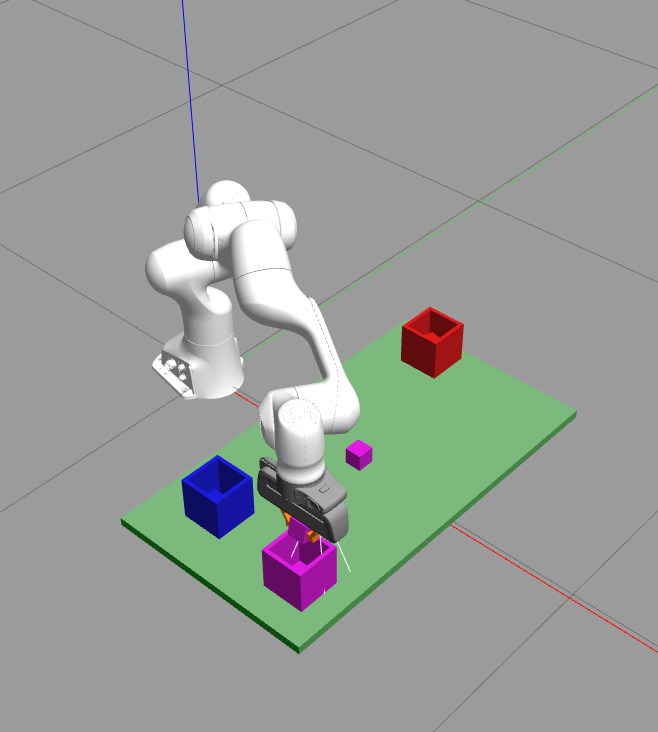

# Pick and Place for Panda Robot Arms

Pick and place is a fundamental robotic manipulation task where a robot arm identifies, grasps, and relocates objects from one position to another. As the task remains a key area of research—due to challenges in scene understanding, grasp reliability, and motion planning—this project aims to explore the core principles of robotic picking and placing.

In this work, we implement solutions using the **C++-based MoveIt library** within a simulated environment for the Panda robot arm. The Panda’s 7-DoF structure and ROS compatibility make it ideal for testing motion planning and manipulation strategies.

The repository presents solutions for **two independent but thematically related projects**, each focusing on different levels of perception, control, and environment complexity:
- **Project A** introduces basic object picking and colour-based placement.
- **Project B** extends capabilities to shape recognition, arbitrary orientations, size variation, and obstacle-aware manipulation.

---

## Repository Layout
```
comp0250_s25_labs/
├── src/
│   ├── cw1_team_09/     # Project A codes
│   └── cw2_team_09/     # Project B codes
└── ...
```

---

## Environment Setup
1. Clone the repository
2. Build the workspace and source it  
   ```bash
   catkin build
   source devel/setup.bash
   ```

3. Install OpenCV following the official [documentation](https://docs.opencv.org/4.x/d7/d9f/tutorial_linux_install.html)

---

## Running a Project

To execute the code, follow these steps:

### Terminal 1

```bash
catkin clean
catkin build
source devel/setup.bash
roslaunch cw1_team_09 run_solution.launch    # for Project A
roslaunch cw2_team_09 run_solution.launch    # for Project B
```

### Terminal 2
Trigger specific tasks by replacing `N` with **1**, **2** or **3**:  
```bash
rosservice call /task N
```
---

## Project A — Cubic Manipulation and Colour Sorting

This project implements fundamental pick-and-place capabilities for the Franka Emika Panda arm using ROS, MoveIt!, and point cloud data. It includes three scenarios increasing in complexity from fixed object positions to autonomous perception-based sorting.

---

### Task Summary

| Task | Objective | Command | Description |
|------|-----------|---------|-------------|
| **1 – Basic Pick & Place** | Pick up a 40 mm cube and place it into a 10 cm basket without collisions. | `rosservice call /task 1` | Reads object and basket poses from the service request. Plans motion via MoveIt!, performs grasping and placing, and returns an empty response. |
| **2 – Basket Colour Identification** | Identify the colour (red, blue, purple) or absence of baskets at specified positions. | `rosservice call /task 2` | Captures point clouds at candidate positions, segments the scene, filters colors in HSV space, and returns a string array of results. |
| **3 – Colour-Matched Sorting** | Sort colored cubes into baskets of matching color with unknown initial positions. | `rosservice call /task 3` | Scans the environment, detects and classifies both cubes and baskets, and performs multiple colour-matched pick-and-place operations. |

---

### Algorithmic Overview

#### Scenario 1: Basic Pick-and-Place
This scenario focuses on object manipulation when both object and basket locations are provided.

Steps:
1. Configure MoveIt! and fix the end-effector orientation.
2. Open the gripper; read the object pose with a 12 cm vertical offset.
3. Lower to the pickup pose and close the gripper.
4. Define the basket pose and approach it from 30 cm above.
5. Place the object by opening the gripper, then return to the home position.

---

#### Scenario 2: Basket Colour Detection
This scenario identifies basket colours using point cloud data and HSV filtering.

Steps:
1. Set up MoveIt! and define a conservative fixed orientation.
2. Transform basket location data from the camera to the world frame.
3. Move the robot to each basket location while maintaining a safe height.
4. Capture point clouds, filter green background, and segment objects.
5. Convert RGB to HSV and determine the colour classification.
6. Return the robot to its home pose between scans and compile colour results.

---

#### Scenario 3: Enhanced Area Scanning and Sorting
In this scenario, object and basket positions are unknown; the robot autonomously detects and sorts items.

Steps:
1. Clear the transform buffer and record the home pose.
2. Define scanning positions: center, 20 cm left, and 20 cm right.
3. At each position, capture and filter point clouds using the method from Scenario 2.
4. Segment clusters and determine their centroids.
5. Label clusters: 1000–2000 pts = box; >3000 pts = basket.
6. In case of duplicates, select clusters with the highest point count.
7. Match boxes to baskets by colour. If no match, skip.
8. Perform the Scenario 1 pick-and-place sequence for each valid pair.
9. Return to the home position after each operation.

---

### Known Issues and Troubleshooting

#### Scenario 1
- Occasional planning failures due to IK or collision constraints. Restarting the code usually resolves the issue.

#### Scenario 2
- May encounter planning issues similar to Scenario 1.
- On systems with low FPS (e.g., using external SSDs), point cloud quality might suffer, affecting the accuracy of colour detection.

#### Scenario 3
- Multiple scanning positions increase the likelihood of path planning errors.
- Restart the launch file if the robot gets stuck or fails to plan.

---


## Project B — Shape Recognition and Advanced Manipulation

This project extends the basic manipulation capabilities of the Panda robot by introducing tasks that require perception of arbitrary object orientations, shape classification, scene analysis, and obstacle-aware path planning. All tasks are executed using ROS, MoveIt!, OpenCV, and the Point Cloud Library (PCL), with a C++ implementation.

---

### Task Summary

| Task | Objective | Command | Description |
|------|-----------|---------|-------------|
| **1 – Orientation-Aware Pick & Place** | Grasp a “nought” or “cross” (40 mm) at any orientation and place it in a brown basket. | `rosservice call /task 1` | Detect the object’s orientation from a point cloud, rotate the gripper to match, perform pick and place into the basket, and return to home pose. |
| **2 – Mystery Shape Matching** | Identify which of two reference shapes matches a third (mystery) shape. | `rosservice call /task 2` | Capture and process point clouds at three given centroids, compute centre-density for classification, and return `1` or `2` based on similarity. |
| **3 – Scene Survey and Object Handling** | Count all shapes (excluding obstacles), find the most common one, and move one instance into the basket while avoiding obstacles. | `rosservice call /task 3` | Perform full-scene scanning, merge and filter point clouds, segment and classify objects, plan obstacle-avoiding trajectory, and report shape counts. |

---

### Algorithmic Overview

#### Scenario 1: Orientation-Aware Pick and Place

This scenario introduces orientation estimation from point clouds and dynamic gripper adjustment.

Steps:
1. Initialize the MoveIt! interface and store the home position.
2. Retrieve object and basket positions from the service request.
3. Move to a top-down view above the object to capture a point cloud.
4. Downsample and filter the point cloud using OpenCV and PCL.
5. Project to a 2D image and detect contours to fit a minimum area bounding rectangle.
6. Extract the yaw angle of the object from the rectangle and adjust the gripper orientation.
7. Open the gripper, approach the object with a safe offset, descend, grasp, and lift.
8. Navigate to the basket pose, descend, release, and return to the home position.

---

#### Scenario 2: Shape Detection and Matching

This scenario requires classifying shapes based on structural properties and comparing them.

Steps:
1. Retrieve the positions of two reference shapes and one mystery shape.
2. Move the robot above each shape and capture the point cloud using `/r200/.../points`.
3. Transform point clouds into the robot’s frame.
4. Crop points around each shape’s centroid and downsample the cloud.
5. Apply HSV filtering to remove background (green) points.
6. Compute the “center density”: the ratio of points concentrated near the centroid.
7. Classify low density as “nought” and high density as “cross.”
8. Match the mystery shape against the references and return the appropriate match number.

---

#### Scenario 3: Scene Survey, Counting, and Obstacle Avoidance

This scenario introduces full-scene perception, shape counting, and safe trajectory planning in the presence of obstacles.

Steps:
1. Move through 8 predefined viewpoints around the scene to capture a 360° point cloud.
2. Supplement this with additional corner views for better coverage.
3. Transform and merge all point clouds into a single scene representation.
4. Remove green background and downsample the merged cloud using voxel grids.
5. Perform Euclidean clustering to segment individual objects.
6. Identify baskets via brown color filtering and detect obstacles using black color thresholds.
7. For each valid cluster:
   - Compute centroid and center-density metric.
   - Classify as “nought” or “cross” based on the metric.
8. Tally total objects and determine which shape is more common.
9. Select one representative of the dominant shape based on confidence and color point count.
10. Calculate the maximum height of all black obstacles in the scene.
11. Add a vertical offset to ensure the object is lifted safely over any detected obstacles.
12. Execute a pick-and-place using the methodology from Scenario 1 with dynamic height adjustments.
13. Return the count of all shapes and the number of the most frequent type in the service response.

---
### Visual Examples

#### Scenario 3: Colour-Matched Sorting Results

### Visual Examples

| Initial Scene | Placing Blue Object | Placing Purple Object |
|---------------|---------------------|------------------------|
|  |  |  |

---

### RViz Configuration

To visualize the system:
- Load the provided config:  
  `comp0250_s25_labs/src/panda_description/rviz/v1.rviz`
- Ensure the following topic is active in RViz:  
  `/r200/camera/depth_registered/points`

---

### System Requirements

- **ROS Dependencies:** `sensor_msgs`, `geometry_msgs`, `moveit`, `tf2_ros`, `cv_bridge`
- **Libraries:** OpenCV for 2D projection and contour analysis; PCL for point cloud filtering, downsampling, and clustering
- **Robot Framework:** Panda robot arm (7-DoF) simulated in Gazebo

---

### Notes on Robustness

The system was designed and tested against edge cases involving:
- Arbitrary object orientations
- Variable object sizes (20 mm, 30 mm, 40 mm)
- Varying number of shapes (up to 7)
- Presence of black obstacles (up to 4)
- Noise in the ground plane (up to 50 mm)

All three scenarios were verified in diverse test conditions to ensure stable behavior and valid grasp execution.

---

## Licence
Distributed under the MIT Licence – see `LICENSE` for full text.


